# Contributing to Corporación Favorita Forecasting Platform

Thank you for your interest in contributing to our retail forecasting platform! This document provides guidelines and instructions for contributing to the project.

## 📋 Table of Contents

- [Code of Conduct](#code-of-conduct)
- [Getting Started](#getting-started)
- [Development Setup](#development-setup)
- [Project Structure](#project-structure)
- [How to Contribute](#how-to-contribute)
- [Coding Standards](#coding-standards)
- [Testing Guidelines](#testing-guidelines)
- [Documentation](#documentation)
- [Pull Request Process](#pull-request-process)
- [Issue Guidelines](#issue-guidelines)
- [Community](#community)

---

## 🤝 Code of Conduct

### Our Pledge

We are committed to providing a welcoming and inclusive environment for all contributors, regardless of background or experience level.

### Our Standards

**Examples of encouraged behavior:**
- ✅ Using welcoming and inclusive language
- ✅ Being respectful of differing viewpoints
- ✅ Gracefully accepting constructive criticism
- ✅ Focusing on what's best for the community
- ✅ Showing empathy towards others

**Examples of unacceptable behavior:**
- ❌ Trolling, insulting/derogatory comments
- ❌ Public or private harassment
- ❌ Publishing others' private information
- ❌ Other unethical or unprofessional conduct

### Enforcement

Violations may be reported to the project maintainers. All complaints will be reviewed and investigated promptly and fairly.

---

## 🚀 Getting Started

### Prerequisites

Before contributing, ensure you have:

- **Python 3.8+** installed
- **Git** for version control
- **Basic understanding** of time series forecasting
- **Familiarity** with pandas, numpy, and scikit-learn

### First-Time Contributors

New to the project? Start here:

1. **Read the README.md** - Understand the project goals
2. **Check Issues** - Look for issues labeled `good first issue` or `help wanted`
3. **Join Discussions** - Introduce yourself and ask questions
4. **Review Documentation** - Familiarize yourself with the codebase

---

## 💻 Development Setup

### 1. Fork and Clone

```bash
# Fork the repository on GitHub
# Then clone your fork
git clone https://github.com/YOUR_USERNAME/corporacion-favorita-forecasting.git
cd corporacion-favorita-forecasting
```

### 2. Create Virtual Environment

```bash
# Create virtual environment
python -m venv venv

# Activate it
# On macOS/Linux:
source venv/bin/activate
# On Windows:
venv\Scripts\activate
```

### 3. Install Dependencies

```bash
# Install in development mode
pip install -e .

# Install development dependencies
pip install -r requirements-dev.txt
```

### 4. Set Up Pre-commit Hooks

```bash
# Install pre-commit
pip install pre-commit

# Install hooks
pre-commit install
```

### 5. Configure Environment

```bash
# Copy example environment file
cp .env.example .env

# Edit .env with your settings
nano .env
```

### 6. Verify Installation

```bash
# Run tests
pytest

# Check code style
flake8 src/
black --check src/

# Type checking
mypy src/
```

---

## 📁 Project Structure

```
corporacion-favorita-forecasting/
├── src/
│   ├── core/
│   │   ├── week_1/          # Week 1 implementations
│   │   ├── week_2/          # Time series models
│   │   │   ├── models/
│   │   │   │   ├── arima/   # ARIMA implementation
│   │   │   │   ├── sarima/  # SARIMA implementation
│   │   │   │   ├── ets/     # ETS implementation
│   │   │   │   └── prophet/ # Prophet implementation
│   │   │   └── preparing/   # Data preparation
│   │   └── week_3/          # ML models
│   └── utils/               # Shared utilities
├── app/                     # Streamlit application
│   ├── pages/              # App pages
│   └── utils/              # App utilities
├── tests/                   # Test suite
├── notebooks/              # Jupyter notebooks
├── data/                   # Data directory
├── docs/                   # Documentation
└── configs/                # Configuration files
```

### Key Directories

- **`src/core/`** - Core forecasting implementations
- **`src/utils/`** - Shared utility functions
- **`app/`** - Streamlit web application
- **`tests/`** - Unit and integration tests
- **`notebooks/`** - Exploratory analysis notebooks
- **`configs/`** - YAML configuration files

---

## 🛠️ How to Contribute

### Types of Contributions

We welcome various types of contributions:

#### 1. **Bug Fixes** 🐛
- Report bugs via GitHub Issues
- Fix existing bugs
- Add regression tests

#### 2. **New Features** ✨
- Propose new forecasting models
- Add visualization capabilities
- Improve data preprocessing
- Enhance evaluation metrics

#### 3. **Documentation** 📚
- Improve README
- Add docstrings
- Write tutorials
- Create examples

#### 4. **Performance Improvements** ⚡
- Optimize algorithms
- Reduce memory usage
- Improve speed

#### 5. **Testing** 🧪
- Add unit tests
- Improve test coverage
- Add integration tests

### Contribution Workflow

```mermaid
graph LR
    A[Fork Repository] --> B[Create Branch]
    B --> C[Make Changes]
    C --> D[Write Tests]
    D --> E[Update Docs]
    E --> F[Commit Changes]
    F --> G[Push Branch]
    G --> H[Create Pull Request]
    H --> I[Code Review]
    I --> J[Address Feedback]
    J --> K[Merge]
```



---

## 📝 Coding Standards

### Python Style Guide

We follow **PEP 8** with some modifications:

#### Code Formatting

```python
# Use Black formatter (line length: 88)
black src/

# Use isort for imports
isort src/

# Use flake8 for linting
flake8 src/
```

#### Naming Conventions

```python
# Classes: PascalCase
class ProphetPipeline:
    pass

# Functions/methods: snake_case
def prepare_data():
    pass

# Constants: UPPER_SNAKE_CASE
MAX_ITERATIONS = 100

# Private methods: leading underscore
def _internal_helper():
    pass
```

#### Imports

```python
# Standard library
import os
import sys
from pathlib import Path

# Third-party
import numpy as np
import pandas as pd
from sklearn.metrics import mean_squared_error

# Local
from src.utils import get_path
from src.core.week_2.models.prophet import ProphetPipeline
```

#### Docstrings

Use **Google-style** docstrings:

```python
def train_model(data: pd.DataFrame, config: Dict[str, Any]) -> Dict[str, float]:
    """
    Train a forecasting model on the provided data.
    
    This function trains a model using the configuration parameters
    and returns evaluation metrics.
    
    Args:
        data: Training dataset with datetime index and target column
        config: Dictionary containing model hyperparameters
            - model_type (str): Type of model to train
            - params (dict): Model-specific parameters
    
    Returns:
        Dictionary containing evaluation metrics:
            - mae (float): Mean Absolute Error
            - rmse (float): Root Mean Squared Error
            - r2 (float): R-squared score
    
    Raises:
        ValueError: If data is empty or missing required columns
        TypeError: If config is not a dictionary
    
    Examples:
        >>> data = pd.DataFrame({'sales': [100, 150, 200]})
        >>> config = {'model_type': 'prophet', 'params': {}}
        >>> metrics = train_model(data, config)
        >>> print(metrics['rmse'])
        12.34
    
    Note:
        The model is automatically saved to the models directory.
    """
    pass
```

#### Type Hints

Always use type hints:

```python
from typing import Dict, List, Optional, Tuple, Any
import pandas as pd
import numpy as np

def process_forecast(
    train: pd.DataFrame,
    test: pd.DataFrame,
    horizon: int = 30,
    confidence: float = 0.95
) -> Tuple[pd.DataFrame, Dict[str, float]]:
    """Process forecast with type hints."""
    pass
```

### Code Quality Tools

#### Required Tools

```bash
# Black - Code formatter
black --line-length 88 src/

# isort - Import organizer
isort --profile black src/

# flake8 - Linter
flake8 --max-line-length 88 --extend-ignore E203,W503 src/

# mypy - Type checker
mypy --ignore-missing-imports src/

# pylint - Additional linting
pylint src/
```

#### Pre-commit Configuration

`.pre-commit-config.yaml`:

```yaml
repos:
  - repo: https://github.com/psf/black
    rev: 23.12.1
    hooks:
      - id: black
        language_version: python3.8
  
  - repo: https://github.com/pycqa/isort
    rev: 5.13.2
    hooks:
      - id: isort
  
  - repo: https://github.com/pycqa/flake8
    rev: 7.0.0
    hooks:
      - id: flake8
        args: ['--max-line-length=88', '--extend-ignore=E203,W503']
  
  - repo: https://github.com/pre-commit/mirrors-mypy
    rev: v1.8.0
    hooks:
      - id: mypy
        additional_dependencies: [types-all]
```

---

## 🧪 Testing Guidelines

### Test Structure

```
tests/
├── unit/                    # Unit tests
│   ├── test_arima.py
│   ├── test_prophet.py
│   └── test_utils.py
├── integration/             # Integration tests
│   ├── test_pipelines.py
│   └── test_workflows.py
├── fixtures/                # Test fixtures
│   └── sample_data.py
└── conftest.py             # Pytest configuration
```

### Writing Tests

Use **pytest** framework:

```python
# tests/unit/test_prophet.py
import pytest
import pandas as pd
import numpy as np
from src.core.week_2.models.prophet import ProphetPipeline


class TestProphetPipeline:
    """Test suite for Prophet pipeline."""
    
    @pytest.fixture
    def sample_data(self):
        """Create sample data for testing."""
        dates = pd.date_range('2023-01-01', periods=100, freq='D')
        values = np.random.randn(100).cumsum() + 100
        return pd.DataFrame({'ds': dates, 'y': values})
    
    @pytest.fixture
    def pipeline(self):
        """Create pipeline instance."""
        return ProphetPipeline(
            store_ids=[1],
            item_ids=[1],
            week=2,
            verbose=False
        )
    
    def test_initialization(self, pipeline):
        """Test pipeline initialization."""
        assert pipeline.week == 2
        assert pipeline.verbose is False
        assert pipeline.store_ids == [1]
    
    def test_prepare_data(self, pipeline, sample_data):
        """Test data preparation."""
        train, test = pipeline.prepare_data(sample_data, split_ratio=0.8)
        
        assert len(train) == 80
        assert len(test) == 20
        assert 'ds' in train.columns
        assert 'y' in train.columns
    
    def test_train_model(self, pipeline, sample_data):
        """Test model training."""
        train, test = pipeline.prepare_data(sample_data)
        pipeline.train_model()
        
        assert pipeline.estimator is not None
        assert pipeline.estimator.fitted is True
    
    def test_evaluate_model_raises_without_forecast(self, pipeline):
        """Test that evaluation raises error without forecast."""
        with pytest.raises(ValueError, match="Generate forecast first"):
            pipeline.evaluate_model()
    
    @pytest.mark.parametrize("split_ratio", [0.7, 0.8, 0.9])
    def test_various_split_ratios(self, pipeline, sample_data, split_ratio):
        """Test different split ratios."""
        train, test = pipeline.prepare_data(sample_data, split_ratio=split_ratio)
        
        expected_train_size = int(len(sample_data) * split_ratio)
        assert len(train) == expected_train_size
        assert len(test) == len(sample_data) - expected_train_size
```

### Running Tests

```bash
# Run all tests
pytest

# Run with coverage
pytest --cov=src --cov-report=html

# Run specific test file
pytest tests/unit/test_prophet.py

# Run specific test
pytest tests/unit/test_prophet.py::TestProphetPipeline::test_initialization

# Run with verbose output
pytest -v

# Run only fast tests
pytest -m "not slow"

# Run in parallel
pytest -n auto
```

### Test Coverage Requirements

- **Minimum coverage**: 80%
- **Critical modules**: 90%+
- **New code**: Must include tests

```bash
# Check coverage
pytest --cov=src --cov-report=term-missing
```

---

## 📖 Documentation

### Documentation Standards

#### 1. **Code Documentation**

Every module, class, and function must have docstrings:

```python
"""
Module docstring explaining the module's purpose.

This module provides functionality for Prophet-based forecasting
including data preparation, model training, and evaluation.
"""

class ProphetPipeline:
    """
    Pipeline for Prophet time series forecasting.
    
    This class manages the complete workflow from data preparation
    through model evaluation and visualization.
    
    Attributes:
        week (int): Week number for organization
        verbose (bool): Whether to print progress messages
        estimator (ProphetEstimator): Trained Prophet model
    """
    pass
```

#### 2. **README Files**

Each major component should have a README:

```
src/core/week_2/models/prophet/
├── README.md              # Prophet module overview
├── prophet_pipeline.py
├── prophet_config.py
└── prophet_evaluator.py
```

#### 3. **Jupyter Notebooks**

Add markdown cells explaining:
- Objectives
- Methodology
- Results interpretation
- Next steps

#### 4. **API Documentation**

We use **Sphinx** for API documentation:

```bash
# Build documentation
cd docs/
make html

# View documentation
open _build/html/index.html
```

### Documentation Checklist

- [ ] Docstrings for all public functions/classes
- [ ] Type hints for all parameters
- [ ] Usage examples in docstrings
- [ ] README updated for new features
- [ ] CHANGELOG.md updated
- [ ] API docs regenerated

---

## 🔄 Pull Request Process

### Before Creating a PR

1. **Update your branch**
   ```bash
   git checkout main
   git pull upstream main
   git checkout your-feature-branch
   git rebase main
   ```

2. **Run tests**
   ```bash
   pytest
   flake8 src/
   black --check src/
   mypy src/
   ```

3. **Update documentation**
   - Add/update docstrings
   - Update README if needed
   - Add entry to CHANGELOG.md

### PR Template

```markdown
## Description
Brief description of changes

## Type of Change
- [ ] Bug fix
- [ ] New feature
- [ ] Breaking change
- [ ] Documentation update

## Related Issues
Closes #123

## Testing
- [ ] Added unit tests
- [ ] Added integration tests
- [ ] All tests passing
- [ ] Coverage maintained/improved

## Checklist
- [ ] Code follows style guidelines
- [ ] Self-review completed
- [ ] Documentation updated
- [ ] No new warnings
- [ ] Tests pass locally
```

### Review Process

1. **Automated Checks** - CI/CD runs tests
2. **Code Review** - Maintainer reviews code
3. **Feedback** - Address review comments
4. **Approval** - At least one approval required
5. **Merge** - Squash and merge to main

### PR Best Practices

- ✅ Keep PRs focused and small
- ✅ Write clear commit messages
- ✅ Reference related issues
- ✅ Respond to reviews promptly
- ✅ Update PR based on feedback

---

## 🐛 Issue Guidelines

### Creating Issues

#### Bug Reports

```markdown
**Describe the bug**
A clear description of what the bug is.

**To Reproduce**
Steps to reproduce:
1. Go to '...'
2. Click on '...'
3. See error

**Expected behavior**
What you expected to happen.

**Screenshots**
If applicable, add screenshots.

**Environment:**
 - OS: [e.g., macOS 12.0]
 - Python: [e.g., 3.9.7]
 - Package versions: [e.g., pandas 1.5.0]

**Additional context**
Any other context about the problem.
```

#### Feature Requests

```markdown
**Is your feature request related to a problem?**
A clear description of the problem.

**Describe the solution you'd like**
A clear description of what you want to happen.

**Describe alternatives you've considered**
Any alternative solutions or features.

**Additional context**
Any other context or screenshots.
```

### Issue Labels

- `bug` - Something isn't working
- `enhancement` - New feature or request
- `documentation` - Documentation improvements
- `good first issue` - Good for newcomers
- `help wanted` - Extra attention needed
- `question` - Further information requested
- `wontfix` - This will not be worked on

---

## 🤝 Community

### Communication Channels

- **GitHub Issues** - Bug reports and feature requests
- **GitHub Discussions** - General questions and ideas
- **Pull Requests** - Code contributions

### Getting Help

- Check existing issues and discussions
- Review documentation
- Ask in GitHub Discussions
- Tag maintainers if urgent

### Recognition

Contributors are recognized in:
- CONTRIBUTORS.md file
- Release notes
- Project documentation

---

## 📜 License

By contributing, you agree that your contributions will be licensed under the same license as the project (MIT License).

---

## 🙏 Thank You!

Thank you for contributing to the Corporación Favorita Forecasting Platform. Your contributions help make this project better for everyone!

### Key Maintainers

- **Guy** - Project Lead
- Open for more maintainers!

### Questions?

Feel free to reach out via:
- GitHub Issues
- GitHub Discussions
- Project email (if available)

---

**Happy Contributing! 🚀**